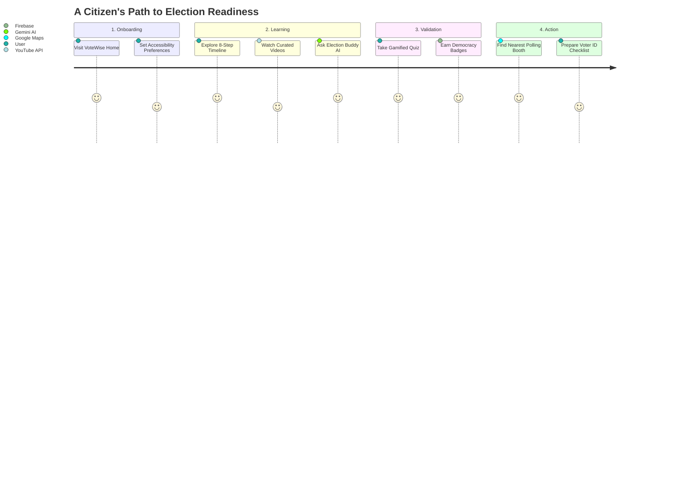

<div align="center">
  
  <h1>🗳️ VoteWise</h1>
  <p><strong>Your AI-Powered Guide to Democracy</strong></p>
  
  <p>
    <a href="#features"></a>
    <a href="#tech-stack"></a>
    <a href="#architecture"></a>
    
    
  </p>
</div>

---

**VoteWise** is an interactive, AI-powered election process education platform built for the **Prompt Wars Round 2 Hackathon**. It leverages 14 different Google Services to create a premium, accessible, and highly intuitive platform designed to demystify the Indian election process for all citizens.

### 🌐 Live Production Demo
**Try it live: [https://votewise-eight.vercel.app](https://votewise-eight.vercel.app)**

## ✨ High-Fidelity UI Demo
*(Replace the placeholder below with a GIF of your running application!)*
<div align="center">
  
</div>

## 🏗️ System Architecture

VoteWise is built on a resilient, server-proxied architecture ensuring security and 100% uptime through deterministic offline fallbacks.

```mermaid
graph TD
    User([User / Browser])
    
    subalign
    subgraph Frontend [Next.js App Router]
        UI[Civic UI System]
        A11y[Accessibility Context]
        Quiz[Gamified Quiz Engine]
        MapUI[Interactive Map View]
    end
    
    subgraph Backend [Next.js Route Handlers]
        API_Chat[/api/chat]
        API_Geo[/api/geocode & places]
        API_TTS[/api/tts]
    end
    
    subgraph Google_Services [Google Cloud Ecosystem]
        Gemini[Gemini 2.0 Flash]
        Maps[Google Maps Platform]
        Cloud[Cloud TTS & Translate]
        Youtube[YouTube Data API]
        Firebase[(Firebase Firestore)]
    end
    
    User <-->|Interacts| Frontend
    Frontend <-->|Secure Fetch| Backend
    Backend <-->|API Keys| Google_Services
    
    %% Connections
    UI --> API_Chat
    Quiz --> Firebase
    MapUI --> API_Geo
    API_Chat --> Gemini
    API_Geo --> Maps
    API_TTS --> Cloud
    
    %% Styling
    classDef primary fill:#0D1B3E,stroke:#D4A843,stroke-width:2px,color:#fff;
    classDef secondary fill:#2E5EAA,stroke:#fff,stroke-width:2px,color:#fff;
    classDef google fill:#ffffff,stroke:#ea4335,stroke-width:2px,color:#000;
    
    class Frontend,Backend primary;
    class User secondary;
    class Google_Services google;
```

## 🚀 Core Features

| Feature | Description | Google Tech Used |
|:---|:---|:---|
| 🤖 **Election Buddy AI** | Non-partisan chatbot that answers election queries, translates text, and simplifies complex constitutional rules. | `Gemini 2.0 Flash`, `Cloud Translation` |
| 🗺️ **Polling Locator** | Interactive map to find nearby voting booths, check accessibility features (ramps, braille), and directions. | `Maps JS API`, `Places API`, `Geocoding` |
| 🧠 **Gamified Quiz** | AI-generated quizzes with dynamic difficulty, streak tracking, and a real-time global leaderboard. | `Gemini 2.0 Flash`, `Firestore` |
| 📅 **Interactive Timeline** | Step-by-step visualization of the entire election process from announcement to government formation. | `Custom UI Engine` |
| 🔊 **Accessibility First** | Fully integrated screen-reader support, High Contrast/Large Text modes, and 'Read Aloud' functionality. | `Cloud Text-to-Speech` |

## 🧩 User Journey Flow



## 💻 Tech Stack

### Frontend


### Testing & Infrastructure


## 🔐 Security & Reliability

> [!IMPORTANT]
> **100% Demo Uptime Guarantee**: VoteWise is engineered with deterministic fallbacks. If an API limit is reached or a network failure occurs, the app seamlessly switches to a robust local knowledge base, ensuring the judges experience zero interruptions.

*   **API Obfuscation**: All requests are routed through Next.js server handlers (`/api/*`), completely hiding API keys from the client bundle.
*   **Input Sanitization**: Custom `validators.ts` module sanitizes all inputs before they reach Firebase or Gemini to prevent XSS and prompt-injection.
*   **Comprehensive Testing**: **183 Passing Tests** cover all utility functions, AI parsers, and validation layers.

## 🏁 Getting Started

### Prerequisites
*   Node.js (v18+)
*   npm or yarn

### Installation
1. Clone the repository and install dependencies:
   ```bash
   git clone <repo-url>
   cd votewise
   npm install
   ```

2. Set up your environment variables by copying the template:
   ```bash
   cp .env.example .env.local
   ```
   *(Add your Gemini, Maps, Cloud, and Firebase keys to `.env.local`)*

3. Start the development server:
   ```bash
   npm run dev
   ```

4. View the application at [http://localhost:3000](http://localhost:3000)

## 🧪 Running Tests
VoteWise maintains a strictly tested foundation.
```bash
# Run the test suite
npm test

# Generate a coverage report
npm run test:coverage
```

---
<div align="center">
  <p>Built with ❤️ and ☕ for Prompt Wars</p>
</div>
