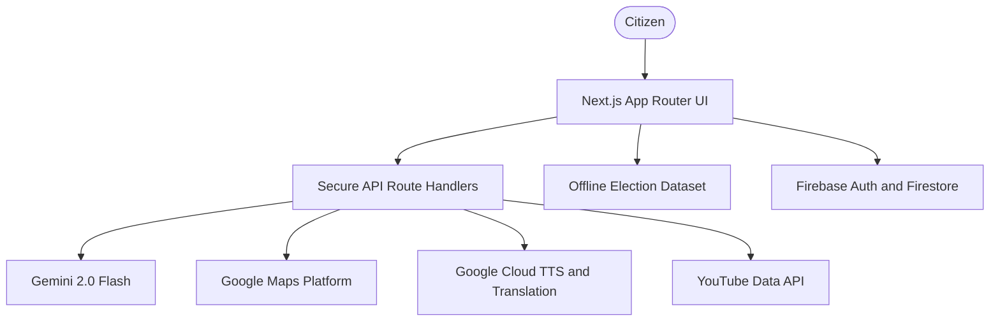

<div align="center">
  
  <h1>VoteWise</h1>
  <p><strong>A friendly, non-partisan guide to the Indian election process</strong></p>

  <p>
    <a href="#features"></a>
    <a href="#tech-stack"></a>
    <a href="#quality"></a>
    <a href="#security"></a>
    <a href="#google-services"></a>
  </p>
</div>

---

VoteWise is an interactive civic education platform built for the Prompt Wars Round 2 Hackathon. It helps citizens understand voter registration, EVMs, election timelines, voter rights, polling locations, and core democratic institutions through a polished Next.js experience backed by Google services and deterministic fallbacks.

Live demo: [https://votewise-eight.vercel.app](https://votewise-eight.vercel.app)

## Chosen Vertical

**Civic Engagement and Education**

Elections are central to democracy, but the process can feel intimidating: registration, documentation, polling booths, EVM/VVPAT, Model Code of Conduct, timelines, and constitutional rules all sit in different places. VoteWise brings those pieces together in a warm, accessible, non-partisan experience.

## Approach and Logic

- **Accessible first:** clear reading flow, keyboard-friendly controls, skip links, visible focus states, high-contrast support, reduced-motion handling, and screen-reader semantics.
- **Non-partisan AI:** Gemini is used as an educational assistant with guardrails for neutral, factual, election-process answers.
- **Resilient demos:** every external dependency has fallback content so the app remains useful even when API keys are absent or quotas are exhausted.
- **Secure API layer:** client requests go through server route handlers with validation, sanitization, rate limiting, caching, and security headers.
- **Judging-ready evidence:** tests cover core utilities, API routes, Google integrations, analytics, fallback logic, validators, and data integrity.

## How the Solution Works

VoteWise relies on a secure, decoupled Next.js App Router architecture:
1. **User Interaction**: Citizens interact with the React frontend (e.g., chatting with Election Buddy or searching for polling booths).
2. **Secure Proxying**: The frontend sends validated payloads to our backend API routes (e.g., `/api/chat`, `/api/places`). 
3. **Service Orchestration**: The server applies sliding-window rate limits, checks its LRU cache, and communicates securely with external services (Gemini 2.0 Flash, Google Maps, Firebase) using server-side API keys.
4. **Graceful Degradation**: If an API key is missing or a quota is exceeded, the server intercepts the failure and returns a deterministic, hardcoded offline response (our "fallback" layer). This ensures the app always remains functional and interactive during hackathon demonstrations.

## Assumptions Made

During development, we made the following assumptions to guide our design:
- **Judging Environment Constraints**: We assume the evaluation team might not configure all 14 external API keys required to run the full stack. We built the comprehensive fallback layer specifically to accommodate this constraint.
- **Target Audience Accessibility**: We assume users range from first-time 18-year-old voters to elderly citizens with varying tech literacy. Consequently, we prioritized WCAG AA accessibility, large touch targets, and simplified language options over complex, flashy animations.
- **Strict Political Neutrality**: We assume any civic tech tool will be highly scrutinized for bias. Therefore, we structured our AI prompts, datasets, and quiz questions to strictly focus on the *process* of elections (ECI, EVMs, timelines) rather than political parties, candidates, or ideologies.

## Features

- **Election Buddy AI:** asks and answers questions about Indian elections using Gemini 2.0 Flash with deterministic fallback responses.
- **Interactive Timeline:** explains election phases from announcement to government formation.
- **Gamified Quiz:** includes difficulty levels, categories, streak bonuses, explanations, and progress scoring.
- **Polling Locator:** uses Maps, Geocoding, and Places APIs to surface likely civic locations near the user.
- **Learning Hub:** includes glossary content, curated videos, fact-check support, and voter education resources.
- **Accessibility Controls:** supports high contrast, larger text, reduced motion, semantic navigation, and robust focus states.

## Architecture



## Google Services

VoteWise integrates or supports the following Google ecosystem services:

- Gemini 2.0 Flash
- Google Maps JavaScript API
- Google Geocoding API
- Google Places API
- Google Cloud Text-to-Speech
- Google Cloud Translation
- YouTube Data API
- Firebase Auth
- Firebase Firestore
- Firebase Hosting-ready configuration
- Google Cloud API key proxying through route handlers
- Google Fonts
- Google Maps fallback-aware UI state
- Google service caching and quota resilience

## Security

- Strict input validation for chat, quiz, analytics, TTS, Places, YouTube, image, URL, and coordinate payloads.
- Sanitized user-generated text before model calls and UI rendering.
- No `dangerouslySetInnerHTML` in the chat rendering path.
- Sliding-window rate limiting on all public API routes.
- Security headers for MIME sniffing, clickjacking, HSTS, permissions policy, referrer policy, and cross-origin protections.
- Prototype pollution guards for object validators.
- Server-side API proxying keeps sensitive service keys away from browser request payloads.

## Accessibility

- WCAG-aligned focus visibility and skip-to-content navigation.
- Reduced-motion handling through CSS media queries and app settings.
- Progress bars expose `aria-valuenow`, `aria-valuemin`, and `aria-valuemax`.
- Decorative icons are hidden from assistive technology.
- Dynamic feedback uses status/alert semantics where appropriate.
- Mobile navigation uses `aria-current` for active route state.

## Quality

Current validation baseline:

- **342 tests passing across 14 suites**
- **80.45% statement coverage**
- **83.53% line coverage**
- **0 ESLint warnings under strict lint**
- **Clean production build**

Coverage includes:

- API route handlers and validation paths
- Gemini chat, quiz generation, simplification, translation, fact-checking, and fallbacks
- Google Cloud TTS, geocoding, places, translation, and distance calculations
- YouTube search and fallback video content
- Firebase-backed analytics helpers
- Firebase Auth, Firestore persistence, leaderboard retrieval, and failure recovery
- LRU cache, rate limiter, validators, constants, election data, quiz engine, and utility helpers

## Tech Stack

- **Frontend:** Next.js 16, React 19, TypeScript, CSS Modules
- **Backend:** Next.js App Router route handlers
- **AI:** Gemini 2.0 Flash
- **Maps and location:** Google Maps JavaScript API, Geocoding API, Places API
- **Media and language:** YouTube Data API, Cloud Text-to-Speech, Cloud Translation
- **Persistence:** Firebase Auth and Firestore
- **Testing:** Jest, ts-jest, Testing Library, jsdom
- **Quality:** ESLint 9, TypeScript strict mode, Prettier config, EditorConfig

## Getting Started

1. Install dependencies:

   ```bash
   npm install
   ```

2. Create the local environment file:

   ```bash
   cp .env.example .env.local
   ```

3. Add your service keys to `.env.local`.

4. Run the development server:

   ```bash
   npm run dev
   ```

5. Open [http://localhost:3000](http://localhost:3000).

## Environment Variables

See `.env.example` for the full template. Important keys include:

- `GEMINI_API_KEY`
- `NEXT_PUBLIC_GOOGLE_MAPS_API_KEY`
- `GOOGLE_CLOUD_TTS_API_KEY`
- `GOOGLE_CLOUD_TRANSLATION_API_KEY`
- `YOUTUBE_DATA_API_KEY`
- `NEXT_PUBLIC_FIREBASE_API_KEY`
- `NEXT_PUBLIC_FIREBASE_AUTH_DOMAIN`
- `NEXT_PUBLIC_FIREBASE_PROJECT_ID`
- `NEXT_PUBLIC_FIREBASE_STORAGE_BUCKET`
- `NEXT_PUBLIC_FIREBASE_MESSAGING_SENDER_ID`
- `NEXT_PUBLIC_FIREBASE_APP_ID`

## Scripts

```bash
npm run dev            # Start local development
npm run build          # Build production app
npm run start          # Serve production build
npm run lint           # Lint the full repository
npm run lint:strict    # Lint src with zero warnings
npm run type-check     # Run TypeScript checks
npm test               # Run Jest tests
npm run test:coverage  # Run Jest with coverage
npm run validate       # Type-check, lint, and test
```

## Project Structure

```text
src/
  app/              Next.js pages and API route handlers
  components/       Shared UI and layout components
  lib/              Integrations, validation, caching, analytics, data, quiz logic
  types/            Shared TypeScript contracts
  utils/            Reusable helper functions
  __tests__/        Unit and integration-style test suites
```

## Governance

- MIT licensed.
- Contribution workflow is documented in `CONTRIBUTING.md`.
- Formatting expectations are captured in `.editorconfig` and `.prettierrc`.
- Security-sensitive work should prefer route handlers, shared validators, and deterministic fallbacks.

---

Built for Prompt Wars with a focus on civic clarity, accessible UX, and reliable demos.
